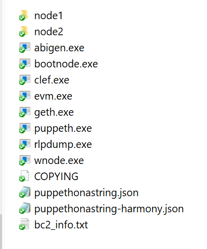
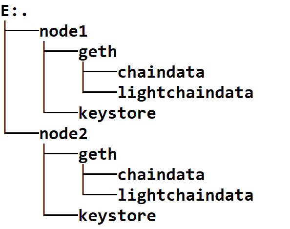
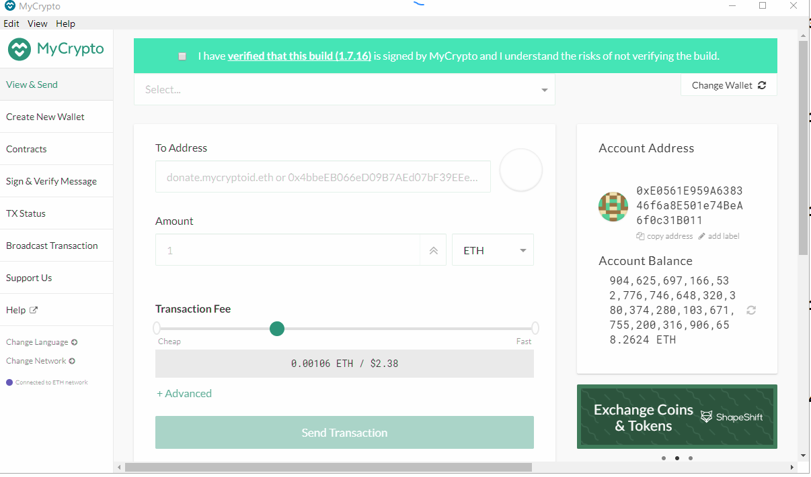
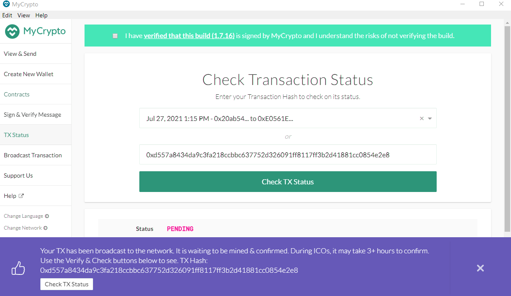
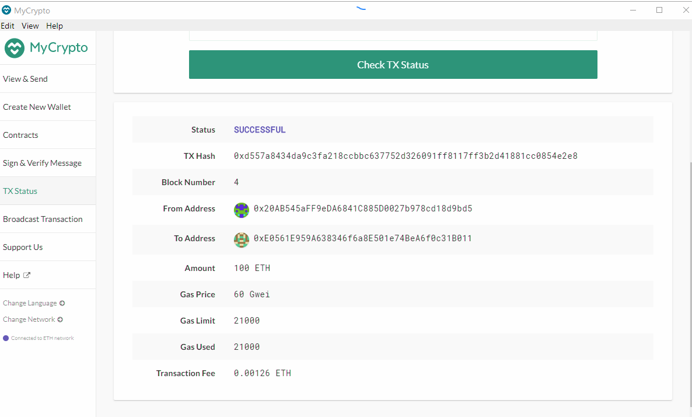

# HW_18_BlockChain
## or How to do a ./puppeth on a (shoe) String
  
To test bitcoin network go to: 
step 5  
I have installed the test network in steps 1 - 4 so you should be able to run it.

### 1. Set up Nodes 
I created two nodes for exchange Crypto: node1 and node2 with the following commands 
./geth --datadir node1 account new 
./geth --datadir node2 account new 

The infor for the nodes are: 
Node 1: 
	pwd: testing 
	Public address of the key:   0x20AB545aFF9eDA6841C885D0027b978cd18d9bd5 
	Path of the secret key file: node1\keystore\UTC--2021-07-27T19-39-50.504693400Z--20ab545aff9eda6841c885d0027b978cd18d9bd5
	forward path: node1/keystore/UTC--2021-07-27T19-39-50.504693400Z--20ab545aff9eda6841c885d0027b978cd18d9bd5 

Node 2: 
	pwd: testing 
	Public address of the key:   0xE0561E959A638346f6a8E501e74BeA6f0c31B011 
	Path of the secret key file: node2\keystore\UTC--2021-07-27T19-35-29.144766600Z--e0561e959a638346f6a8e501e74bea6f0c31b011 
	forward path: node2/keystore/UTC--2021-07-27T19-35-29.144766600Z--e0561e959a638346f6a8e501e74bea6f0c31b011 

### 2. Generate Genesis 
I generated a Genesis network using ./puppeth  
named: puppethonastring 
network id: 333 
Type: Proof of Authority 
The files are shown in the directory: 
 

### 3. Initialize Nodes
I then initialized the nodes 
./geth init puppethonastring.json --datadir node1 
./geth init puppethonastring.json --datadir node2 
 

### 4. Mine 
I then started the block chains 
./geth --datadir node1 --unlock "0x20AB545aFF9eDA6841C885D0027b978cd18d9bd5" --mine --rpc --allow-insecure-unlock 

./geth --datadir node2 --unlock "0xE0561E959A638346f6a8E501e74BeA6f0c31B011" --mine --port 30304 --bootnodes "enode://c06b642873d1a0570815e5d422d38d288c020c898cc84e6fd37d5990903052a2487934afae29a8c8ec0445c710abf0cd0520d989bf99e78870a8691597191dd4@127.0.0.1:30303" --ipcdisable --allow-insecure-unlock 

### 5. Test
I started up MyCrypto. You can transfer crypto between your wallets.
 
!mycrypt](ScreenShots/mycrypto.png) 
 
 
